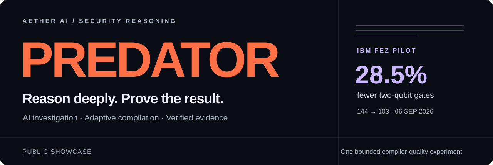
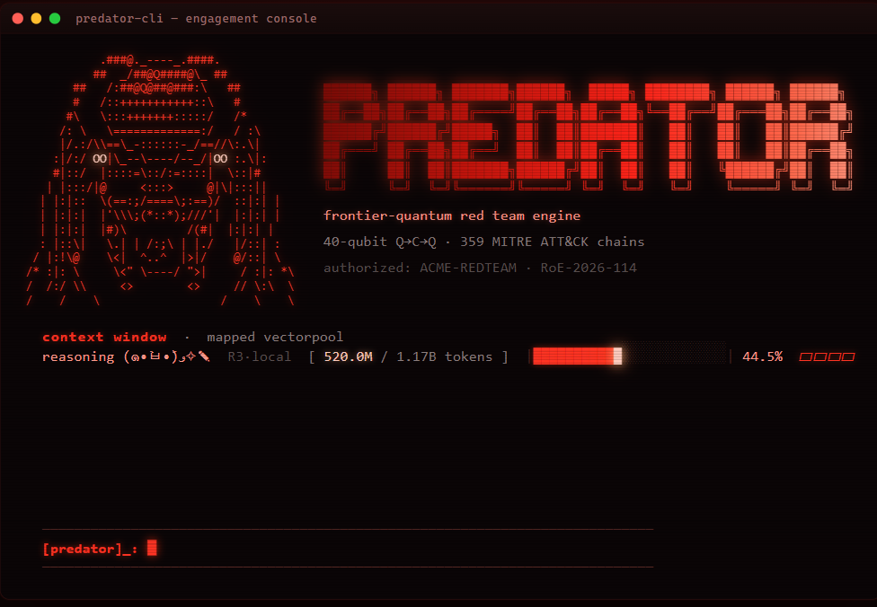

  

  
  
  

**Predator connects AI security reasoning, adaptive compilation, and verification in one operator workflow.** Built by Aether AI for authorized security work.

| 🔴 Investigate | 🔵 Compile | 🟢 Verify |
| :--- | :--- | :--- |
| Reason with context and prior observations. | Reconstruct computational structure and evaluate execution routes. | Challenge findings and check native outcomes. |
| **Predator · Observatory** | **AQRC · Nano** | **Atlas · Crucible** |

## 🟣 On IBM Quantum hardware

The **September 6, 2026 IBM Fez pilot** compared ordinary compilation with AQRC’s **joint5** path on a fixed task.

| Hardware footprint | Recorded result |
| :--- | :--- |
| Native two-qubit gates, each pole | **144 → 103 · 28.5% fewer** |
| Acquisition | **4 circuits × 1,024 shots** |
| Billed QPU time | **3 seconds** |

Both tested outputs moved closer to their ideal distributions:

| Total-variation distance ↓ | Ordinary | joint5 | Relative reduction |
| :--- | ---: | ---: | ---: |
| Vulnerable pole | 0.395175 | **0.316523** | **19.9%** |
| Fixed pole | 0.403859 | **0.307958** | **23.7%** |

> **Scope:** one fixture, two poles, one hardware job. This is a compiler-quality pilot. Expected energy increased; improved minimization, deep-chain lift, and quantum computational advantage are not established. Independent confirmation has not been performed.

**[Measurement note, uncertainty & provenance →](docs/research/ibm-fez-pilot.md)** · **[Public result JSON ↓](docs/research/ibm-pilot.json)**

<strong>🔴 Step inside the Predator console</strong>

 

*Interface illustration. Session values, model labels, and counters are examples, not benchmark evidence.*

## Explore the project

This public repository contains the product overview, GitHub Pages site, and a curated IBM result summary. The proprietary CLI and backend implementation remain private. CLI capabilities depend on the authorized backend; hardware execution requires separate authorization.

**[Visit the showcase →](https://aetherai3.github.io/predator-cli/)** · **[Discuss access with Aether AI →](https://aethersystems.net/)**

© 2026 Aether AI LLC. All rights reserved. Public visibility does not grant a software or content license. IBM is identified as the hardware provider; no affiliation or endorsement is implied.
