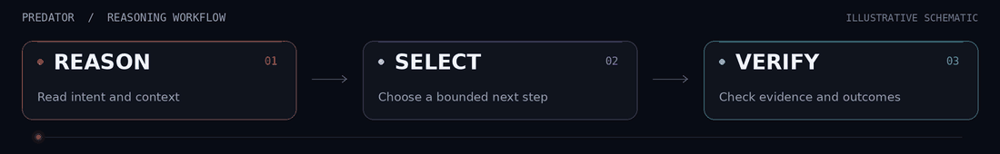
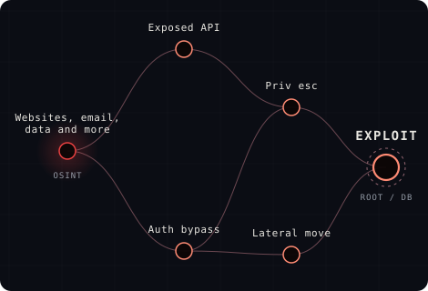

   
  <strong>AETHER AI · SECURITY RESEARCH</strong>

  

  
   
  
  

**Predator connects AI security reasoning, attack-chain modelling, adaptive compilation, and verification.** The restricted CLI brings that workflow to authorized software analysis; Aether’s operator-led engagements extend it to scoped infrastructure assessments.

   
  The original Predator terminal image. Session values, labels, and counters are illustrative.

  

## 🟣 Measured on IBM Quantum hardware

**IBM Fez · September 6, 2026.** AQRC’s **joint5** path used **28.5% fewer native two-qubit gates** than ordinary compilation on both tested poles.

| Fewer gates | Acquisition | Billed QPU time |
| :---: | :---: | :---: |
| **144 → 103** | **4 circuits × 1,024 shots** | **3 seconds** |

Both measured outputs moved closer to their exact ideal distributions:

| Total-variation distance ↓ | Ordinary | joint5 | Relative reduction |
| :--- | ---: | ---: | ---: |
| Vulnerable pole | 0.395175 | **0.316523** | **19.9%** |
| Fixed pole | 0.403859 | **0.307958** | **23.7%** |

> **One fixture. Two poles. One hardware job.** This is a compiler-quality pilot; independent confirmation has not been performed. Expected energy increased, so improved minimization, deep-chain lift, and quantum computational advantage are not established.

**[Measurement note & uncertainty →](docs/research/ibm-fez-pilot.md)** · **[Full-precision public results →](docs/research/ibm-pilot.json)**

## 🔴 Inside the defense stack

| Predator CLI | Operator-led red team |
| :--- | :--- |
| Restricted access for analysis of your own code, investigation of chained vulnerabilities, and verification. | Scoped assessments of authorized infrastructure, with validated findings and a remediation roadmap. |

   
  Campaign illustration from Aether’s website. The broader engagement surface is separate from CLI access.

<strong>Explore the engine underneath</strong>

| Layer | Role |
| :--- | :--- |
|  **[Nano](https://github.com/AetherAI3/Nano)** | Structured language for campaign behaviour. |
| **[Unlimited Context](https://github.com/AetherAI3/Unlimited-Context-LLM)** | Persistent state across long-running investigations. |
| **[Aether Protocol](https://github.com/AetherAI3/PROTOCOL-C)** | Signed, timestamped records and tamper-evident commitments. |
| **AQRC · Atlas · Crucible** | Adaptive compilation, classical challenge, and native verification. |

The [defense-stack page](https://aethersystems.net/defense-stack#defense-stack) describes the wider offering, including ATT&CK-aligned campaign modelling and AI-injection research. [Aether Actions](https://aethersystems.net/actions) provides the separate automated repository security-check offering.

---

**Public overview, visual assets, and research summary.** The proprietary CLI and backend remain private. Engagements require authorization; CLI capabilities depend on the authorized backend.

© 2026 Aether AI LLC. All rights reserved. IBM is the hardware provider; no affiliation or endorsement is implied. <a href="docs/assets/SOURCES.md">Visual sources</a>.
